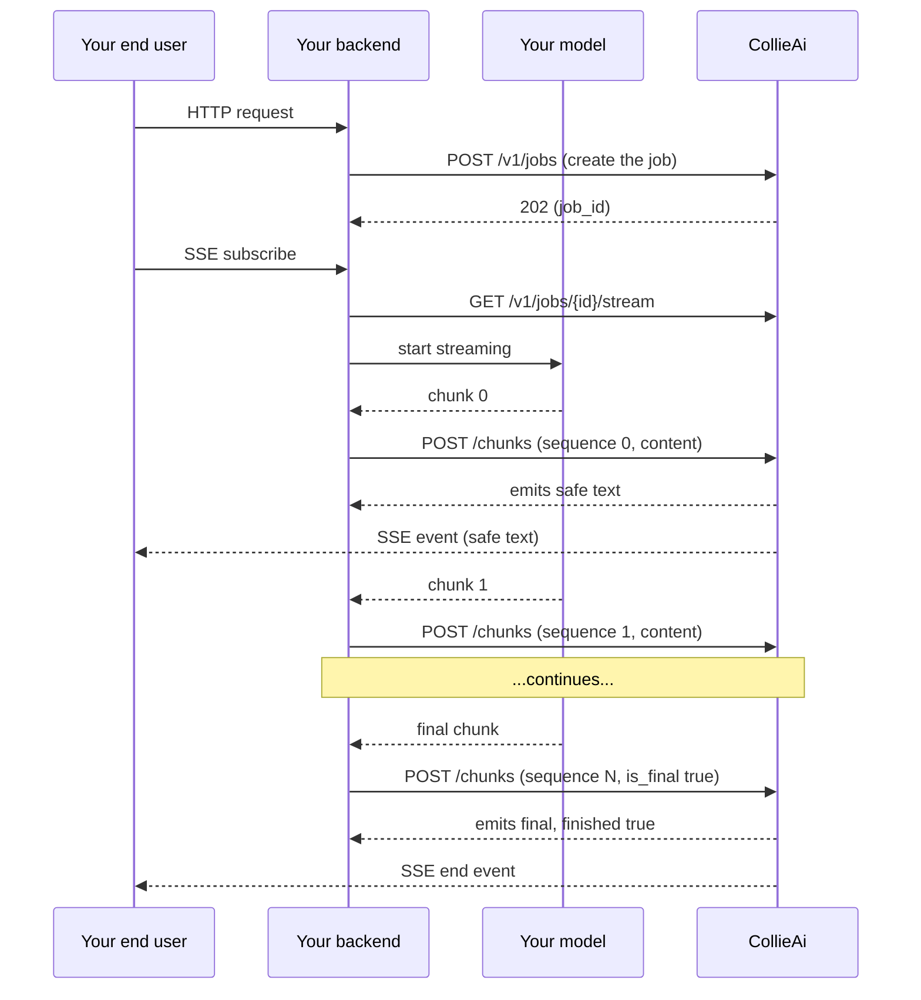

# Customer-owned streaming

When you call your own LLM (a model you host, a non-OpenAI provider, or an OpenAI call you make directly without going through CollieAi as a proxy), you can still get streaming output filtering by **pushing chunks** into a job as they arrive from the upstream model. CollieAi filters each chunk through the project's policy and either returns the safe text inline or publishes it on a Server-Sent Events stream you can connect to from a browser.

This is the pattern to use when **the** [**drop-in proxy**](../proxy-integration/streaming.md) **doesn't fit** — typically because you're not on OpenAI/Anthropic, or you need control over the upstream call that the proxy doesn't expose.

## When should you use customer-owned streaming?

| Scenario                                                                                                         | What to use                                                                                    |
| ---------------------------------------------------------------------------------------------------------------- | ---------------------------------------------------------------------------------------------- |
| You're calling OpenAI or an OpenAI-compatible API and want filtered streaming                                    | [Drop-in proxy streaming](../proxy-integration/streaming.md) — set `stream: true`, you're done |
| You're calling Anthropic directly and want filtered streaming                                                    | [Drop-in proxy streaming](../proxy-integration/streaming.md) — works for `/v1/messages` too    |
| You're calling **any other model** (open-source, self-hosted, multi-provider router) and want filtered streaming | **This page** — push chunks to `POST /v1/jobs/{id}/chunks`                                     |
| You want filtering but no streaming                                                                              | [Creating jobs](creating-jobs.md) (legacy `message` / `message_output` flow)                   |

## Architecture



You always have two delivery paths to the end user:

1. **Inline** — read `emits[].content` from each `POST /chunks` response and forward it from your backend to the end user yourself (any transport: SSE, WebSocket, polling). The chunk response contains everything you need; the SSE endpoint is optional.
2. **SSE relay** — let your end user subscribe to `GET /v1/jobs/{id}/stream` (proxied through your backend for auth) and only `POST /chunks` from the backend. CollieAi publishes each accepted emit on the SSE stream automatically.

Most apps pick one. The SSE relay is convenient when the end user is a browser; the inline path is simpler when the consumer is also a backend service.

## Quick start

### 1. Create the job

Same as any async job — `POST /v1/jobs`:

```bash
curl -X POST https://app.collieai.io/v1/jobs \
  -H "Authorization: Bearer clai_xxx" \
  -H "Content-Type: application/json" \
  -d '{
    "message_input": "Tell me about quarterly earnings",
    "webhook_url": "https://your-app.com/webhooks/collieai"
  }'
```

You don't need a separate "this job will receive chunks" flag — any job is eligible for chunk submission as long as the project's policy is streaming-eligible.


**Note on webhooks:** terminal webhooks (`job.outbound_complete` / `job.outbound_blocked`) fire for the **webhook async-job flow** (legacy `message`/`message_output` submission). For chunk-ingestion jobs, terminal state is signaled by the `finished: true` flag on the last `POST /chunks` response and by the `event: end` frame on `GET /stream` — no webhook is fired at the end of a chunk stream. The `webhook_url` field on the job is still required at creation time (the field is global to all jobs) but isn't used for chunk-ingestion sessions.


### 2. Push chunks as the upstream model streams

```python
import httpx
import uuid

API_KEY = "clai_xxx"
JOB_ID = "job_abc123def456"  # from step 1

async def stream_upstream_through_collieai(job_id: str):
    async with httpx.AsyncClient() as client:
        sequence = 0
        async for raw_chunk in your_upstream_model_stream():
            r = await client.post(
                f"https://app.collieai.io/v1/jobs/{job_id}/chunks",
                headers={"Authorization": f"Bearer {API_KEY}"},
                json={
                    "sequence": sequence,
                    "content": raw_chunk.text,
                    "is_final": False,
                },
                timeout=10.0,
            )
            r.raise_for_status()
            body = r.json()
            for emit in body["emits"]:
                if emit["blocked"]:
                    # A rule blocked — terminate your upstream
                    # generation, surface the block to the user.
                    handle_block(emit["triggered_rules"])
                    return
                if emit["content"]:
                    yield emit["content"]
            sequence += 1
            if body["finished"]:
                return

        # Final flush — empty content with is_final=true tells the
        # engine to drain its stable-window buffer.
        r = await client.post(
            f"https://app.collieai.io/v1/jobs/{job_id}/chunks",
            headers={"Authorization": f"Bearer {API_KEY}"},
            json={"sequence": sequence, "content": "", "is_final": True},
            timeout=10.0,
        )
        for emit in r.json()["emits"]:
            if emit["content"]:
                yield emit["content"]
```

### 3. (Optional) Subscribe to the SSE stream

```python
async with httpx.AsyncClient() as client:
    async with client.stream(
        "GET",
        f"https://app.collieai.io/v1/jobs/{JOB_ID}/stream",
        headers={
            "Authorization": f"Bearer {API_KEY}",
            "Accept": "text/event-stream",
        },
        timeout=None,
    ) as r:
        async for line in r.aiter_lines():
            if line.startswith("data: "):
                event_data = json.loads(line[len("data: "):])
                # Forward to your end user...
```

## Sequence numbers and idempotency

Chunks are numbered `0, 1, 2, ...`. The contract is **monotonic with no gaps** — submitting `sequence=2` before CollieAi sees `sequence=1` returns `409 chunk_sequence_conflict` with `expected_sequence` and `received_sequence` fields.

Re-submitting the **last** sequence with the **same body** is an idempotent retry — you get the cached response back, no double-filtering. This is what lets you retry safely on network errors without producing duplicate emits.

Re-submitting the same sequence with a **different body** is a contract violation — you get `409 chunk_idempotency_conflict`. If you need to send different content, use a new sequence.

## Terminal state

A session is terminal when:

* You submit a chunk with `is_final=true` and the response comes back with `finished=true`.
* A rule fires a block on any chunk. The response has an emit with `blocked=true` and `finished=true`.

Once terminal, subsequent submits return `409 chunk_session_finished` — create a new job to start a new stream. The terminal state is also published as the SSE `end` event with `reason: final` (`is_final` flush), `reason: blocked` (rule block), or `reason: session_unrecoverable` (a rare commit failure that can't be repaired by retry).

## Error handling

The error envelope is the same OpenAI-compatible shape used elsewhere: `{"error": {"message", "type", "code"}}`. The full list lives in the [`POST /chunks` API reference](../api-reference/jobs.md#post-v1jobsjob_idchunks). The codes you'll handle most often:

| Code                           | What to do                                                                                                                                                                                       |
| ------------------------------ | ------------------------------------------------------------------------------------------------------------------------------------------------------------------------------------------------ |
| `chunk_sequence_conflict`      | Re-sync to the `expected_sequence` field in the error body.                                                                                                                                      |
| `chunk_filter_timeout` (`504`) | Retry the SAME sequence with backoff. The chunk wasn't accepted; retries are safe via idempotency.                                                                                               |
| `chunk_concurrent_submit`      | Another submit is in flight. Serialize submissions per job\_id.                                                                                                                                  |
| `chunk_session_finished`       | The session is over (final or block). Stop submitting; this job is done.                                                                                                                         |
| `chunk_streaming_unsupported`  | The project's policy can't stream (e.g. has an LLM-detection rule). Use the [synchronous `/response` endpoint](../api-reference/jobs.md#post-v1jobsjob_idresponse) instead, or split the policy. |
| `chunk_session_unrecoverable`  | A prior commit failure left the stream in an unrepairable state (very rare). Create a new job.                                                                                                   |
| `chunk_idempotency_conflict`   | You re-submitted a sequence with a different body. Use a new sequence number for new content.                                                                                                    |

## SSE consumer semantics

The SSE endpoint publishes **only emits the API has accepted** — partial-write entries from a failed commit pipeline are never visible. Subscribers may freely disconnect and reconnect using the standard `Last-Event-ID` HTTP header:

```bash
curl -N https://app.collieai.io/v1/jobs/job_abc123def456/stream \
  -H "Authorization: Bearer clai_your_api_key" \
  -H "Accept: text/event-stream" \
  -H "Last-Event-ID: 5-2"
```

Server resumes from the event after `5-2`. Without the header, the full backlog from chunk 0 is replayed — useful for first-time subscribers connecting late.

Periodic `: keepalive\n\n` comments are sent when no new emits arrive; treat them as no-ops. The stream always closes with a single `event: end` carrying a `reason` field — see the [API reference](../api-reference/jobs.md#get-v1jobsjob_idstream) for the full list.

## Limits

* **Per-chunk filter budget**: 2 seconds by default. Exceeding returns `504 chunk_filter_timeout`; retry with backoff.
* **Per-chunk content size**: 64 KB. Larger chunks should be split client-side.
* **Concurrent submits per job**: 1. Submissions must be serial.
* **Job state TTL**: 1 hour after the last activity. Long-running streams that idle past the TTL need a fresh job.
* **Stream retention**: 10,000 emits per job. Real-time consumers don't hit this; consumers that catch up from history may, in which case earlier emits are no longer replayable.

## Compared to the drop-in proxy

| Aspect              | Drop-in proxy streaming                             | Chunk ingestion (this page)                               |
| ------------------- | --------------------------------------------------- | --------------------------------------------------------- |
| Who calls the LLM   | CollieAi (you point your SDK at `app.collieai.io`)  | You (CollieAi never sees your provider credentials)       |
| Models supported    | OpenAI-compatible, Anthropic                        | Any model — you do the inference                          |
| Streaming format    | Native OpenAI / Anthropic SSE on the proxy response | CollieAi-shaped SSE on `/v1/jobs/{id}/stream`             |
| Filter timing       | Per-token, transparent                              | Per-submitted-chunk; you control batching                 |
| Mid-stream block UX | Provider's native error event                       | `blocked: true` emit + `reason: blocked` SSE end          |
| Best for            | Drop-in replacement for OpenAI/Anthropic            | Multi-provider stacks, self-hosted models, custom routers |

## Next steps

* [`POST /v1/jobs/{id}/chunks` API reference](../api-reference/jobs.md#post-v1jobsjob_idchunks) — full request/response/error shapes
* [`GET /v1/jobs/{id}/stream` API reference](../api-reference/jobs.md#get-v1jobsjob_idstream) — SSE event format and resume semantics
* [Webhooks](webhooks.md) — terminal-state durable notifications for the webhook async-job flow (chunk-ingestion sessions terminate via `finished: true` on the chunk response and `event: end` on the SSE stream instead)

### Frequently asked questions

**Can I filter streaming output from a self-hosted or custom model?** Yes. CollieAi's customer-owned streaming lets you push your model's output chunks to a job and receive real-time, rule-filtered text back — for self-hosted, open-source, or multi-provider models that don't go through the drop-in proxy.

**How is customer-owned streaming different from the drop-in proxy?** With the drop-in proxy, CollieAi calls the LLM for you and streams the filtered response. With customer-owned streaming, you call your own model and push chunks to CollieAi for filtering, so CollieAi never sees your provider credentials.
