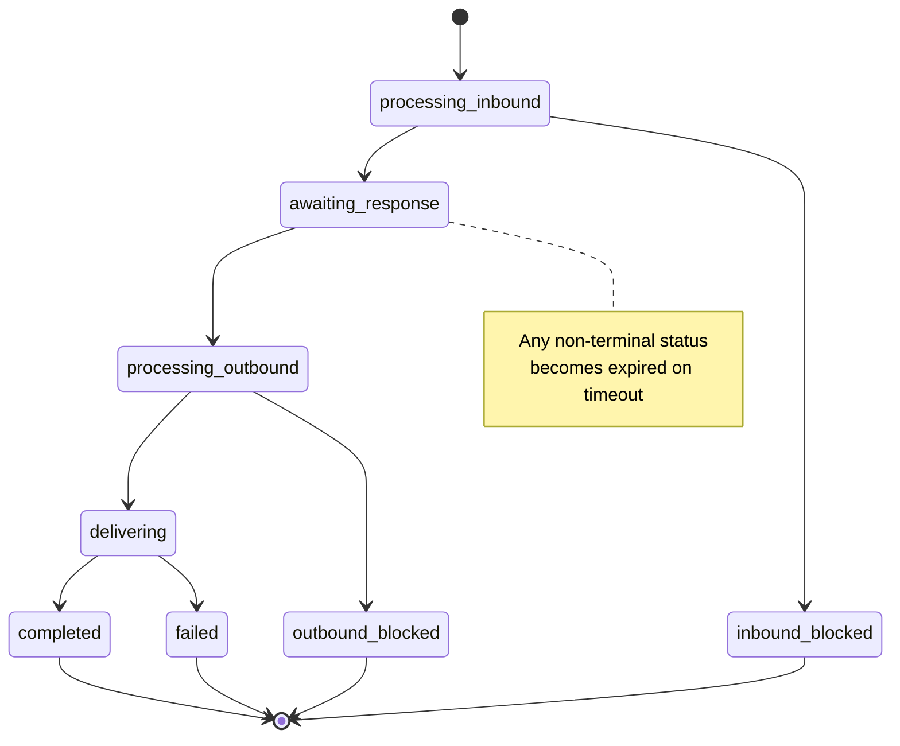

# Job lifecycle

Every job moves through a series of statuses from creation to completion. Understanding the lifecycle helps you handle each state correctly and build reliable integrations.

## Status Flow




In combined mode (both `message_input` and `message_output` provided), the job skips `awaiting_response` and moves directly from input to output processing.


***

## All Statuses

| Status                | Description                                                                                                    |
| --------------------- | -------------------------------------------------------------------------------------------------------------- |
| `processing_inbound`  | Input content is being filtered against your rules.                                                            |
| `inbound_blocked`     | Input content was blocked by a policy rule. **Terminal.**                                                      |
| `awaiting_response`   | Input filtering is complete. Waiting for you to submit the LLM response via `POST /v1/jobs/{job_id}/response`. |
| `processing_outbound` | Output content (LLM response) is being filtered.                                                               |
| `outbound_blocked`    | Output content was blocked by a policy rule. **Terminal.**                                                     |
| `delivering`          | Webhook delivery is in progress.                                                                               |
| `completed`           | All webhooks delivered successfully. **Terminal.**                                                             |
| `failed`              | Webhook delivery failed after all retry attempts. **Terminal.**                                                |
| `expired`             | The job timed out before completing. **Terminal.**                                                             |

***

## Polling

If you need to check a job's status outside the webhook flow, poll the status endpoint:

```
GET /v1/jobs/{job_id}
```

```bash
curl https://app.collieai.io/v1/jobs/job_abc123def456 \
  -H "Authorization: Bearer clai_xxx"
```

```json
{
  "job_id": "job_abc123def456",
  "status": "awaiting_response",
  "created_at": "2026-02-23T10:30:00Z",
  "expires_at": "2026-02-23T11:30:00Z"
}
```

Use polling as a fallback when webhooks are not received, not as a primary mechanism. Webhooks provide faster notification with less overhead.

***

## Expiration

Jobs have a configurable time-to-live. If a job does not reach a terminal status before its expiration time, it moves to `expired`.

| Setting            | Value                    |
| ------------------ | ------------------------ |
| Default expiration | 1 hour (3,600 seconds)   |
| Maximum expiration | 7 days (604,800 seconds) |

Set a custom expiration when [creating the job](creating-jobs.md):

```json
{
  "message_input": "...",
  "webhook_url": "...",
  "expires_in_seconds": 7200
}
```

Expiration is most relevant in the separate two-hook pattern, where the job waits in `awaiting_response` for you to submit the LLM response. If your LLM calls take a long time, increase the TTL accordingly.

***

## Queue Monitoring

Check the health of the processing pipeline:

```
GET /api/v1/health/queues
```

```bash
curl https://app.collieai.io/api/v1/health/queues \
  -H "Authorization: Bearer clai_xxx"
```

This returns the current depth of processing queues, helping you detect backlogs or processing delays.

***

## Best Practices



### Store the webhook secret immediately

The `webhook_secret` is returned only once, in the job creation response. Store it right away -- you need it to [verify every webhook](webhooks.md) for that job.

```python
job = await create_job(...)
await db.save_webhook_secret(job["job_id"], job["webhook_secret"])
```



### Handle idempotency

Due to [webhook retries](webhooks.md), your endpoint may receive the same event more than once. Use the `job_id` and event type as a composite key to deduplicate:

```python
event_key = f"{payload['job_id']}:{payload['event']}"
if event_key in processed_events:
    return {"status": "already_processed"}
processed_events.add(event_key)
```



### Set appropriate expiration based on LLM response times

Match the `expires_in_seconds` value to your workflow. If your LLM responds in seconds, the default 1-hour expiration provides generous headroom. For batch processing or workflows with human review, increase the expiration to match.



### Monitor job status if webhooks are not received

If your webhook endpoint experiences downtime, poll `GET /v1/jobs/{job_id}` to check whether the job completed. This ensures you do not miss filtered content.



### Handle blocked content gracefully

When content is blocked (`inbound_blocked` or `outbound_blocked`), the job will not proceed further. Design your application to handle this -- for example, show the user a message explaining that their input could not be processed, or return a safe fallback response.



### Use separate input and output fields for best ML accuracy

Prefer `message_input` and `message_output` over the legacy `message` field. CollieAI applies different rule sets to input and output content. Using the correct fields gives the ML models better context and improves filtering accuracy.



***

## Next Steps

* [Creating Jobs](creating-jobs.md) -- endpoint reference and code examples
* [Webhooks](webhooks.md) -- payload format, signature verification, and retry policy
