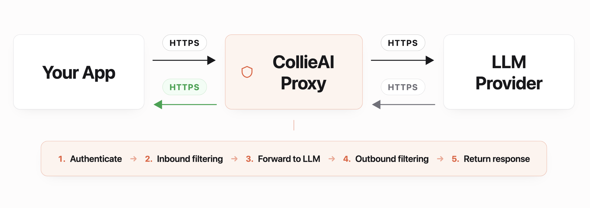

# Overview

CollieAI acts as a **drop-in proxy** between your application and OpenAI. Change two configuration values -- your base URL and API key - and every request is automatically filtered through your project's security policies. No code changes, no new dependencies, no refactoring.

## How It Works

<figure><figcaption></figcaption></figure>

1. **Authenticate** - CollieAI validates your `clai_` API key and resolves the associated project.
2. **Input filtering** - User messages are checked against all active input rules (PII masking, prompt injection detection, keyword blocking, etc.).
3. **Forward to OpenAI** - The filtered request is sent to OpenAI using your project's provider token.
4. **Output filtering** - The model's response is checked against all active output rules.
5. **Return response** - A standard OpenAI-compatible response is returned to your application.

## Key Benefits

* **Zero code changes.** The request and response format is identical to the OpenAI API. Just update `base_url` and `api_key`.
* **Works with all OpenAI SDKs.** Official Python SDK, Node.js SDK, and any HTTP client that speaks the OpenAI protocol.
* **Full streaming (SSE) support.** Streaming works exactly as it does with the OpenAI API. Output rules are still enforced.
* **Multi-tenant.** Each API key maps to a project with its own set of rules and provider tokens.
* **Transparent filtering.** Both input (user to model) and output (model to user) content is filtered automatically.

## Quick Example

```python
from openai import OpenAI

client = OpenAI(
    base_url="https://app.collieai.io/v1",
    api_key="clai_your_api_key_here"
)

response = client.chat.completions.create(
    model="gpt-4o-mini",
    messages=[{"role": "user", "content": "Hello!"}]
)

print(response.choices[0].message.content)
```

That is the entire integration. Everything else - PII redaction, prompt injection blocking, keyword filtering - happens automatically based on the rules configured in your CollieAI project.

## Response Metadata

CollieAI metadata is returned via response headers, keeping the response body 100% OpenAI-compatible:

| Header                 | Type    | Description                                                                                                                                                                                            |
| ---------------------- | ------- | ------------------------------------------------------------------------------------------------------------------------------------------------------------------------------------------------------ |
| `X-Collie-Duration-Ms` | integer | Proxy processing time in milliseconds. For non-streaming this is the full round-trip; for streaming it reflects setup time (auth + input filtering) since headers are sent before the stream begins. |
| `X-Collie-Proxied-At`  | integer | Unix timestamp when the request was processed.                                                                                                                                                         |
| `X-Collie-Api-Version` | string  | API version (currently `v1`).                                                                                                                                                                          |

These headers are included on responses that reach the proxy pipeline (200, 400 policy blocks, 429 rate limits, upstream errors). Early rejections before the proxy runs (401 auth, 403 IP block, 422 validation) do not include them. They do not interfere with standard OpenAI SDK parsing.

## Message Filtering Scope

The **filter\_all\_messages** project setting controls which messages in the conversation are evaluated by input rules:

| Setting           | Behavior                                                                                                                                             |
| ----------------- | ---------------------------------------------------------------------------------------------------------------------------------------------------- |
| `true`            | All messages in the `messages` array are filtered. Use this for maximum coverage when the full conversation history is submitted on each request.    |
| `false` (default) | Only the last message in the `messages` array is filtered. This is more efficient when earlier messages have already been checked on prior requests. |

This setting can be configured per-project in the CollieAI dashboard.

## Drop-in Proxy vs Async Jobs

CollieAI offers two integration modes. Choose the one that fits your architecture.

|                        | Drop-in Proxy                                                | Async Jobs                                                        |
| ---------------------- | ------------------------------------------------------------ | ----------------------------------------------------------------- |
| **How it works**       | Change `base_url` to CollieAI; we proxy to OpenAI            | Submit content via the Jobs API; receive results via webhook      |
| **Latency**            | Synchronous -- response in real time                         | Asynchronous -- results delivered later                           |
| **Who calls the LLM?** | CollieAI proxies the call to OpenAI for you                  | You call your own LLM and submit content for filtering            |
| **Streaming**          | Full SSE streaming support                                   | Not applicable                                                    |
| **Integration effort** | Minimal -- two config changes                                | Requires a webhook endpoint to receive results                    |
| **Best for**           | Chat applications, real-time assistants, any OpenAI SDK user | Batch processing, custom LLM providers, high-throughput pipelines |

**Use the drop-in proxy when** you want the fastest path to protection. If you are already calling OpenAI, you can be up and running in minutes.

**Use async jobs when** you need to bring your own model, process content in bulk, or integrate filtering into an event-driven architecture.

## Next Steps

* [OpenAI SDK Integration](/broken/pages/a5c1d2183649c31a7697c100544251e8daae7d6b) -- Complete setup guide for Python, Node.js, cURL, and function calling
* [Streaming](/broken/pages/c32f772965802d02a882edaaf8b613ba6c9cf950) -- How streaming works with CollieAI, including output filtering behavior
* [Error Handling](/broken/pages/3a261b1d83b8ea5d0332fd6292c8928a46dade2b) -- Error format, policy violation responses, and troubleshooting
