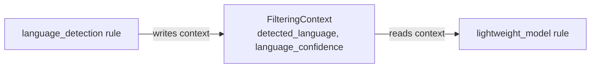

# Prompt injection

## What is prompt injection detection in CollieAi?

The Lightweight Model rule type enables detection of **prompt injection** and **jailbreak attempts** using pre-trained ML classification models. The rule evaluates messages against the model and applies policy actions based on the classification result.

**Ideal for:**

* Detecting prompt injection attacks
* Blocking jailbreak attempts
* Protecting LLM-based applications from adversarial inputs
* Defense-in-depth alongside other rule types


**Key points**

* CollieAi detects prompt injection and jailbreak attempts with pre-trained ML classifiers (the `lightweight_model` rule type).
* Inference is fast — 10–50 ms on CPU, 2–10 ms on GPU — for high-throughput, first-line defense.
* Available models include Sentinel v2 (default), DeBERTa v3, and PromptGuard, each with a configurable confidence threshold (0.8 recommended).
* A `min_length` setting and language-based routing reduce false positives, and long messages are scanned with overlapping windows.


## Supported Models


**The model dropdown in your dashboard shows what's available on YOUR deploy.** The exact list depends on what your operator has configured for this host. The two classifiers documented below are typically available on managed deploys; self-hosted deployments may show additional options (such as `codeintegrity-ai/promptguard`) or a narrowed set.


### 1. Sentinel v2 (Default)

| Property         | Value                                              |
| ---------------- | -------------------------------------------------- |
| **Model ID**     | `qualifire/prompt-injection-jailbreak-sentinel-v2` |
| **Architecture** | DistilBERT-based                                   |
| **Size**         | \~270MB                                            |
| **Max Tokens**   | 512                                                |
| **Gated**        | No (public access)                                 |

**Labels:**

| Label       | Meaning                                | Block This? |
| ----------- | -------------------------------------- | ----------- |
| `jailbreak` | Prompt injection or jailbreak detected | **Yes**     |
| `benign`    | Normal, safe content                   | No          |

**Web Interface Configuration:**

* **Model ID:** `qualifire/prompt-injection-jailbreak-sentinel-v2`
* **Labels to Block:** `jailbreak`
* **Threshold:** `0.8` (recommended)

***

### 2. DeBERTa Injection Detector

| Property         | Value                               |
| ---------------- | ----------------------------------- |
| **Model ID**     | `deepset/deberta-v3-base-injection` |
| **Architecture** | DeBERTa v3 base                     |
| **Size**         | \~440MB                             |
| **Max Tokens**   | 512                                 |
| **Gated**        | No (public access)                  |

**Labels:**

| Label       | Meaning                   | Block This? |
| ----------- | ------------------------- | ----------- |
| `INJECTION` | Prompt injection detected | **Yes**     |
| `LEGIT`     | Legitimate, safe content  | No          |

**Web Interface Configuration:**

* **Model ID:** `deepset/deberta-v3-base-injection`
* **Labels to Block:** `INJECTION`
* **Threshold:** `0.8` (recommended)

***

### 3. PromptGuard (ModernBERT)

| Property         | Value                            |
| ---------------- | -------------------------------- |
| **Model ID**     | `codeintegrity-ai/promptguard`   |
| **Architecture** | ModernBERT-base                  |
| **Size**         | \~570MB                          |
| **Max Tokens**   | 8,192                            |
| **Gated**        | Yes (requires HuggingFace token) |


The main branch is broken. You **must** specify the revision!


**Labels:**

| Label     | Meaning                        | Block This? |
| --------- | ------------------------------ | ----------- |
| `LABEL_1` | Malicious / Injection detected | **Yes**     |
| `LABEL_0` | Benign / Safe content          | No          |

**Web Interface Configuration:**

* **Model ID:** `codeintegrity-ai/promptguard`
* **Model Revision:** `ac22d9f0af2343226c4ff978ce2ba6a4cddeaa6d` ← **Required!**
* **Labels to Block:** `LABEL_1`
* **Threshold:** `0.8` (recommended)

**Requirements:**

* Set `HF_TOKEN` in your `.env` file
* Accept model terms at https://huggingface.co/codeintegrity-ai/promptguard

***

## Quick Reference: Labels to Block

| Model                                              | Labels to Block | Revision Required                                   |
| -------------------------------------------------- | --------------- | --------------------------------------------------- |
| `qualifire/prompt-injection-jailbreak-sentinel-v2` | `jailbreak`     | No                                                  |
| `deepset/deberta-v3-base-injection`                | `INJECTION`     | No                                                  |
| `codeintegrity-ai/promptguard`                     | `LABEL_1`       | **Yes:** `ac22d9f0af2343226c4ff978ce2ba6a4cddeaa6d` |


Using the wrong label will cause the rule to never trigger. Always verify the label matches the model.


***

## Web Interface Configuration

### Step-by-Step Setup



### Navigate to Rules

Click **"Add Rule"**.



### Select Rule Type

Select `lightweight_model` (or "ML Model").



### Fill in the fields

| Field               | Description                         | Example                             |
| ------------------- | ----------------------------------- | ----------------------------------- |
| **Name**            | Descriptive name                    | `Block Prompt Injections`           |
| **Model ID**        | Select from dropdown                | `deepset/deberta-v3-base-injection` |
| **Labels to Block** | Label(s) that trigger the rule      | `INJECTION`                         |
| **Threshold**       | Confidence threshold (0.0-1.0)      | `0.8`                               |
| **Direction**       | When to apply                       | Input                               |
| **Decision**        | What to do on match                 | `block`                             |
| **Order**           | Processing priority (lower = first) | `1`                                 |



### Save

Save the rule.



### Example Configurations

#### Configuration A: Sentinel v2 (Block)

```
Name:           Block Prompt Injections (Sentinel)
Model ID:       qualifire/prompt-injection-jailbreak-sentinel-v2
Labels to Block: jailbreak
Threshold:      0.8
Direction:      Input
Decision:       block
Order:          1
```

#### Configuration B: DeBERTa (Block)

```
Name:           Block Prompt Injections (DeBERTa)
Model ID:       deepset/deberta-v3-base-injection
Labels to Block: INJECTION
Threshold:      0.8
Direction:      Input
Decision:       block
Order:          1
```

#### Configuration C: PromptGuard (Block) - Requires Revision

```
Name:           Block Prompt Injections (PromptGuard)
Model ID:       codeintegrity-ai/promptguard
Model Revision: ac22d9f0af2343226c4ff978ce2ba6a4cddeaa6d
Labels to Block: LABEL_1
Threshold:      0.8
Direction:      Input
Decision:       block
Order:          1
```


PromptGuard requires `HF_TOKEN` to be set and the specific revision above.


#### Configuration D: High Sensitivity (Lower Threshold)

```
Name:           High Sensitivity Detection
Model ID:       qualifire/prompt-injection-jailbreak-sentinel-v2
Labels to Block: jailbreak
Threshold:      0.7
Direction:      all
Decision:       block
Order:          1
```

#### Configuration F: Reduce False Positives (Higher Threshold)

```
Name:           Low False Positive Detection
Model ID:       qualifire/prompt-injection-jailbreak-sentinel-v2
Labels to Block: jailbreak
Threshold:      0.95
Direction:      Input
Decision:       block
Order:          1
```

***

## Threshold Guidelines

| Threshold | Trade-off                                      | Use Case                              |
| --------- | ---------------------------------------------- | ------------------------------------- |
| `0.70`    | More false positives, catches more attacks     | High-security applications            |
| `0.80`    | Balanced (recommended default)                 | General use                           |
| `0.90`    | Fewer false positives, may miss subtle attacks | User-facing applications              |
| `0.95`+   | Only high-confidence detections                | When false positives are unacceptable |

### Handling False Positives

If legitimate messages are being blocked:

1. **Increase threshold** (e.g., 0.80 → 0.90 or 0.95)
2. **Increase min\_length** - Short messages like "Mark as private?" or "Download history" often trigger false positives. The default `min_length: 40` skips messages under 40 characters.
3. **Add allow rules** with lower order number to whitelist specific patterns
4. **Change decision** from `block` to `mask` for softer handling

### Minimum Length Setting

The `min_length` parameter skips ML analysis for very short messages, reducing false positives:

| min\_length | Effect                                                                   |
| ----------- | ------------------------------------------------------------------------ |
| `0`         | Analyze all messages (no minimum)                                        |
| `40`        | Skip messages under 40 chars (default, reduces \~40% of false positives) |
| `60`        | Skip messages under 60 chars (more aggressive filtering)                 |
| `100`       | Skip only very short messages                                            |


Short messages like UI button labels, menu items, or brief commands are rarely effective prompt injections but can trigger false positives. Real attacks typically require longer text to be effective.


Example allow rule (runs before ML rule):

```
Name:           Allow German Accounting Terms
Rule Type:      regex
Order:          0  (lower than ML rule)
Direction:      Input
Decision:       allow
Pattern:        (?i)(buchhaltung|spendenquittung|verbuchen)
```

***

## How It Works

### Processing Flow

```
1. Message received
        ↓
2. Check: Is message length >= min_length?
        ↓
   NO  → Skip ML analysis, continue to next rule
   YES ↓
3. Text tokenized (max 512 tokens per window)
        ↓
4. Model classifies text → returns label + confidence
        ↓
5. Check: Is label in labels_to_block AND confidence >= threshold?
        ↓
   YES → Apply decision (block/mask/allow)
   NO  → Continue to next rule
```

### Long Message Handling (Windowing)

For messages longer than 512 tokens:

1. Text is split into **overlapping windows** (default 64 token overlap)
2. Each window is classified independently
3. Results are aggregated using **max-pooling** per label
4. If **ANY window** triggers, the message is flagged

This ensures attacks hidden in long messages are still detected.

***

## API Configuration (JSON)

For API-based rule creation:

### Sentinel v2

```json
{
  "name": "Block Prompt Injections",
  "rule_type": "lightweight_model",
  "order": 1,
  "direction": "inbound",
  "decision": "block",
  "config": {
    "model_id": "qualifire/prompt-injection-jailbreak-sentinel-v2",
    "threshold": 0.80,
    "labels_to_block": ["jailbreak"],
    "min_length": 40
  },
  "block_message": "Your message was blocked due to detected security risk."
}
```

### DeBERTa

```json
{
  "name": "Block Prompt Injections",
  "rule_type": "lightweight_model",
  "order": 1,
  "direction": "inbound",
  "decision": "block",
  "config": {
    "model_id": "deepset/deberta-v3-base-injection",
    "threshold": 0.80,
    "labels_to_block": ["INJECTION"],
    "min_length": 40
  },
  "block_message": "Your message was blocked due to detected security risk."
}
```

***

## Advanced Configuration

### All Configuration Options

| Property                       | Type   | Default                                 | Description                                                     |
| ------------------------------ | ------ | --------------------------------------- | --------------------------------------------------------------- |
| `model_id`                     | string | `qualifire/...sentinel-v2`              | HuggingFace model ID                                            |
| `model_revision`               | string | `null`                                  | Git commit hash for version pinning                             |
| `threshold`                    | float  | `0.80`                                  | Confidence threshold (0.0-1.0)                                  |
| `labels_to_block`              | list   | `["jailbreak", "INJECTION", "LABEL_1"]` | Labels that trigger                                             |
| `min_length`                   | int    | `40`                                    | Skip messages shorter than this (reduces false positives)       |
| `token_max_length`             | int    | `512`                                   | Max tokens per window                                           |
| `max_chars`                    | int    | `50000`                                 | Max characters to process                                       |
| `window_overlap`               | int    | `64`                                    | Token overlap between windows                                   |
| `inference_timeout`            | float  | `30.0`                                  | Timeout in seconds                                              |
| `batch_size`                   | int    | `8`                                     | Batch size for window inference                                 |
| `mask_placeholder`             | string | `[PROMPT_INJECTION_REDACTED]`           | Replacement text for masking                                    |
| `decision_on_error`            | enum   | `allow`                                 | `allow` (fail-open) or `block` (fail-closed)                    |
| `languages`                    | list   | `null`                                  | ISO 639-1 codes to process (requires `language_detection` rule) |
| `language_threshold`           | float  | `0.5`                                   | Confidence threshold for language match                         |
| `language_decision_on_missing` | enum   | `process`                               | `process` or `skip` when no language in context                 |

### Decision on Error

| Setting | Behavior                                    | Use Case              |
| ------- | ------------------------------------------- | --------------------- |
| `allow` | Fail-open: message passes if model fails    | Availability priority |
| `block` | Fail-closed: message blocked if model fails | Security priority     |

***

## Language-Based Model Routing

The lightweight model rule supports **language-based routing**, allowing you to apply different ML models to messages based on their detected language. This is useful for optimizing detection accuracy by using language-specific models.

### How It Works

1. A `language_detection` rule runs first and writes the detected language to a **shared context**
2. The `lightweight_model` rule reads the language from context
3. If the detected language matches the configured `languages` list, the rule processes the message
4. If the language doesn't match, the rule skips to the next rule in the pipeline



### Configuration Options

| Property                       | Type  | Default   | Description                                       |
| ------------------------------ | ----- | --------- | ------------------------------------------------- |
| `languages`                    | list  | `null`    | ISO 639-1 codes (e.g., `["en", "es"]`) to process |
| `language_threshold`           | float | `0.5`     | Minimum confidence for language match             |
| `language_decision_on_missing` | enum  | `process` | Behavior when no language detected                |

#### `language_decision_on_missing` Options

| Value     | Behavior                                                                   |
| --------- | -------------------------------------------------------------------------- |
| `process` | Process with ML model even if no language in context (backward compatible) |
| `skip`    | Skip the rule entirely if no language in context                           |

### Example: Multi-Language Pipeline

Route messages to different models based on language:



### Language Detection Rule (order=10)

```json
{
  "name": "Detect Language",
  "rule_type": "language_detection",
  "order": 10,
  "direction": "inbound",
  "decision": "allow",
  "config": {
    "mode": "blocklist",
    "languages": ["xx"],
    "threshold": 0.3
  }
}
```

This rule detects language and writes to context. The blocklist with a non-existent language code means all real languages pass through.



### English with DeBERTa v3 (order=20)

```json
{
  "name": "English Prompt Guard",
  "rule_type": "lightweight_model",
  "order": 20,
  "direction": "inbound",
  "decision": "block",
  "config": {
    "model_id": "deepset/deberta-v3-base-injection",
    "threshold": 0.80,
    "labels_to_block": ["INJECTION"],
    "languages": ["en"],
    "min_length": 40
  },
  "block_message": "Prompt injection detected"
}
```



### Russian/Ukrainian with Sentinel v2 (order=30)

```json
{
  "name": "Russian Sentinel",
  "rule_type": "lightweight_model",
  "order": 30,
  "direction": "inbound",
  "decision": "block",
  "config": {
    "model_id": "qualifire/prompt-injection-jailbreak-sentinel-v2",
    "threshold": 0.80,
    "labels_to_block": ["jailbreak"],
    "languages": ["ru", "uk"],
    "min_length": 40
  },
  "block_message": "Prompt injection detected"
}
```



### Catch-All for Other Languages (order=100)

```json
{
  "name": "Catch-All Sentinel",
  "rule_type": "lightweight_model",
  "order": 100,
  "direction": "inbound",
  "decision": "block",
  "config": {
    "model_id": "qualifire/prompt-injection-jailbreak-sentinel-v2",
    "threshold": 0.80,
    "labels_to_block": ["jailbreak"],
    "min_length": 40
  },
  "block_message": "Prompt injection detected"
}
```

No `languages` configured = processes all messages (catch-all)



### Behavior Matrix

| Scenario                                                   | Result                                     |
| ---------------------------------------------------------- | ------------------------------------------ |
| Language detection ran → language in list                  | Process with configured model              |
| Language detection ran → language NOT in list              | Skip rule, continue to next                |
| Language detection NOT ran + `decision_on_missing=process` | Process with ML (no language filter)       |
| Language detection NOT ran + `decision_on_missing=skip`    | Skip rule, continue to next                |
| `languages` config not set                                 | Process all messages (backward compatible) |

### Benefits

1. **Better Accuracy**: Use models optimized for specific languages
2. **Performance**: Skip ML inference for languages a model wasn't trained on
3. **Flexibility**: Easy to add language-specific models without code changes
4. **Backward Compatible**: Existing rules without `languages` config work unchanged

***

## Operational Notes

### Model Preloading

Models are loaded at application startup when `PRELOAD_MODELS=true` (default).

**Without preloading:** First request loads the model (\~60-80 seconds delay)\
**With preloading:** First request is fast, but startup takes longer

### Memory Usage

| Model       | RAM     | VRAM (GPU) |
| ----------- | ------- | ---------- |
| Sentinel v2 | \~500MB | \~300MB    |
| DeBERTa v3  | \~800MB | \~500MB    |
| PromptGuard | \~350MB | \~200MB    |

### Latency

| Device     | Typical Latency     |
| ---------- | ------------------- |
| CPU        | 10-50ms per message |
| GPU (CUDA) | 2-10ms per message  |

***

## Rule Order Best Practices

**Important:** ML models should run **BEFORE** normalization rules. Models are trained on original text and perform worse on lowercased/normalized text.

Recommended order:

```
Order 1:  lightweight_model  ← ML detection FIRST
Order 10: normalization      ← Clean text after ML
Order 20: structured_id      ← PII detection
Order 30: regex              ← Pattern matching
Order 40: aho_corasick       ← Dictionary matching
```

***

## Troubleshooting

### Why isn't the rule blocking attacks?

1. **Check labels\_to\_block** - Must match model's output labels exactly
   * Sentinel: `jailbreak` (not `JAILBREAK`)
   * DeBERTa: `INJECTION` (not `injection`)
2. **Check threshold** - May be too high; try lowering to 0.7
3. **Check rule is enabled** - Verify `is_enabled: true`
4. **Check direction** - Ensure it matches (**Input**, **Output**, or **All**)
5. **Check rule order** - Another rule with lower order may be allowing first

### Why are there too many false positives?

1. **Raise threshold** - Try 0.90 or 0.95
2. **Add allow rules** - Whitelist specific patterns
3. **Check language** - Models trained primarily on English

### Why isn't the model loading?

1. **Check logs** for errors
2. **Verify model\_id** is in allowed list
3. **Check disk space** (\~1GB needed for cache)
4. **Check network** - Models download from HuggingFace

### Why is latency high?

1. **First request** loads model - expect 60-80s delay
2. **Enable preloading** - Set `PRELOAD_MODELS=true`
3. **Use GPU** if available

***

## Adding New Models

To add a new model, update these files:

1. `app/services/model_service.py` - Add to `ALLOWED_MODELS` (single source of truth — `LightweightModelConfig` in `app/schemas/rule_configs.py` imports this list automatically)
2. Update this documentation with labels

**Requirements for new models:**

* Must be a HuggingFace text classification model
* Must have `id2label` mapping in config
* Should be tested locally before production use

## Security Considerations

1. **Model allowlist** - Only approved models can be loaded
2. **Input truncation** - Long inputs are windowed, not truncated silently
3. **Fail-safe modes** - Configure `decision_on_error` based on requirements
4. **Logging** - All matches are logged to ClickHouse for review

### Frequently asked questions

**How does CollieAi detect prompt injection?** CollieAi detects prompt injection with pre-trained ML classifiers that score each message for injection and jailbreak attempts and block it when the confidence passes your threshold (0.8 by default).

**What is the best protection against prompt injection?** CollieAi recommends layering a fast ML classifier (the lightweight\_model rule) as a first line of defense with LLM-based detection for novel attacks, and placing both before text normalization so they evaluate the original input.

**Can CollieAi detect jailbreak attempts?** Yes. CollieAi's prompt injection models (Sentinel v2, DeBERTa, PromptGuard) classify messages as jailbreak/injection or benign, and you choose which labels to block and at what confidence threshold.

**How do I reduce false positives in prompt injection detection?** Raise the confidence threshold (for example 0.90–0.95), increase `min_length` to skip very short messages, add allow rules for known-safe patterns, or switch the decision from block to mask.
