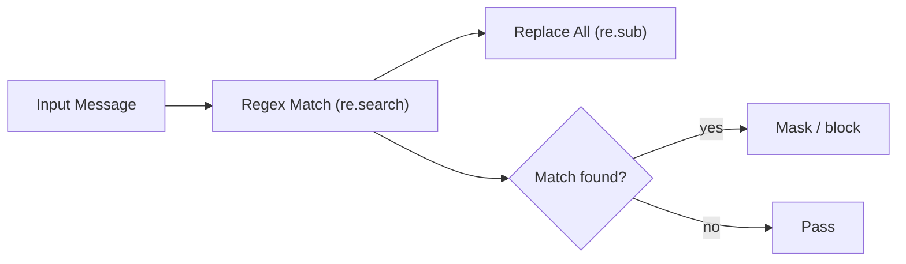

# Regex patterns

## What is the regex rule type?

The Regex rule type enables pattern matching using **Python regular expressions**. It's the most flexible rule type for detecting and masking custom patterns in messages.

**Ideal for:**

* Custom PII patterns (internal employee IDs, custom formats)
* Domain-specific sensitive data
* Keywords with variations (spelling, formatting)
* Simple pattern-based masking
* Detecting specific text formats


**Key points**

* The regex rule type detects and masks custom patterns in LLM messages using Python regular expressions.
* CollieAi ships 28 built-in presets across personal data, secrets and keys, and network/infrastructure.
* Each match can be masked with a custom replacement or a repeated mask character, or used to block the request.
* Regex offers the most flexibility; structured IDs and dictionary matching trade flexibility for fewer false positives.


## How do regex rules work?





### The pattern is compiled

The pattern is compiled with optional flags (case-insensitive, multiline, etc.).



### The pattern is searched

Pattern is searched against the input message using `re.search()`.



### Matches are replaced

If a match is found:

* All occurrences are replaced using `re.sub()`
* Replacement text is either custom or generated using mask character



### Metadata is included

Metadata includes: matched text, position, replacement used.



## Rule Configuration

### Properties

| Property      | Type    | Required  | Default | Description                                                        |
| ------------- | ------- | --------- | ------- | ------------------------------------------------------------------ |
| `patterns`    | array   | **Yes**\* | -       | Array of pattern entries (see below)                               |
| `mask_char`   | string  | No        | `*`     | Character for auto-generated mask (single char)                    |
| `pattern`     | string  | No        | -       | **Legacy** — single pattern (converted to `patterns[]` internally) |
| `replacement` | string  | No        | -       | **Legacy** — used with single `pattern`                            |
| `flags`       | integer | No        | `0`     | **Legacy** — used with single `pattern`                            |

\* Either `patterns` (new) or `pattern` (legacy) must be provided.

### Pattern Entry

Each entry in the `patterns` array:

| Property      | Type    | Required | Default            | Description                       |
| ------------- | ------- | -------- | ------------------ | --------------------------------- |
| `pattern`     | string  | **Yes**  | -                  | Python regular expression pattern |
| `replacement` | string  | No       | `*` × match length | Text to replace matches with      |
| `flags`       | integer | No       | `0`                | Python regex flags (see below)    |

### Regex Flags

Use Python's `re` module flag values:

| Flag            | Value | Description                              |
| --------------- | ----- | ---------------------------------------- |
| `re.IGNORECASE` | 2     | Case-insensitive matching                |
| `re.MULTILINE`  | 8     | `^` and `$` match line boundaries        |
| `re.DOTALL`     | 16    | `.` matches newline characters           |
| `re.VERBOSE`    | 64    | Allow whitespace and comments in pattern |

Combine flags by adding values: `re.IGNORECASE + re.MULTILINE = 10`

## System Presets

The UI provides **28 built-in system patterns** organized into three categories. When using system patterns, you select presets from a checklist — no manual regex writing required.

### Personal Data

| Preset                        | Replacement        |
| ----------------------------- | ------------------ |
| SSN (US)                      | `***-**-****`      |
| Email Addresses               | `[EMAIL]`          |
| Credit Card Numbers           | `[CARD_REDACTED]`  |
| Phone Numbers (US)            | `[PHONE_REDACTED]` |
| Phone Numbers (International) | `[PHONE_REDACTED]` |
| US EIN                        | `**-*******`       |

### Secrets & Keys

| Preset                             | Replacement                       |
| ---------------------------------- | --------------------------------- |
| Bearer Tokens / API Keys           | `[REDACTED]`                      |
| Private Keys (PEM / OPENSSH / PGP) | `[PRIVATE_KEY_REDACTED]`          |
| AWS Access Keys                    | `[AWS_KEY_REDACTED]`              |
| AWS Secret Access Key              | `[AWS_SECRET_REDACTED]`           |
| JWT Tokens                         | `[JWT_REDACTED]`                  |
| GitHub Tokens                      | `[GITHUB_TOKEN_REDACTED]`         |
| Google API Keys                    | `[GOOGLE_API_KEY_REDACTED]`       |
| Stripe Keys                        | `[STRIPE_KEY_REDACTED]`           |
| OpenAI-style API Keys              | `[OPENAI_KEY_REDACTED]`           |
| GitLab PAT                         | `[GITLAB_TOKEN_REDACTED]`         |
| Slack Tokens                       | `[SLACK_TOKEN_REDACTED]`          |
| Generic Secret Assignments         | `[SECRET_REDACTED]`               |
| Authorization Basic Header         | `Authorization: Basic [REDACTED]` |
| Credentials in URL                 | `[URL_CREDENTIALS_REDACTED]`      |
| Database Connection Strings        | `[REDACTED]`                      |

### Network & Infrastructure

| Preset                       | Replacement                            |
| ---------------------------- | -------------------------------------- |
| UUIDs                        | `********-****-****-****-************` |
| Internal Parameter Injection | _(blocks — no replacement)_            |
| Internal URLs                | `[REDACTED_URL]`                       |
| IP Addresses (IPv4)          | `[IP_REDACTED]`                        |
| IPv6 Addresses               | `[IP_REDACTED]`                        |
| Slack Webhooks               | `[SLACK_WEBHOOK_REDACTED]`             |
| Discord Webhooks             | `[DISCORD_WEBHOOK_REDACTED]`           |

### Using System Presets via API

System presets are selected in the UI but stored as regular `patterns[]` entries. To use presets via API, include their patterns directly:

```json
{
  "name": "PII Protection",
  "rule_type": "regex",
  "decision": "block",
  "direction": "all",
  "config": {
    "mask_char": "*",
    "patterns": [
      {
        "pattern": "\\b\\d{3}-\\d{2}-\\d{4}\\b",
        "replacement": "***-**-****",
        "flags": 0
      },
      {
        "pattern": "\\b[A-Za-z0-9._%+-]+@[A-Za-z0-9.-]+\\.[A-Za-z]{2,}\\b",
        "replacement": "[EMAIL]",
        "flags": 0
      }
    ]
  }
}
```

## Examples

### Email Masking

Detect and mask email addresses:

```json
{
  "name": "Email Masking",
  "rule_type": "regex",
  "decision": "mask",
  "direction": "all",
  "config": {
    "pattern": "\\b[A-Za-z0-9._%+-]+@[A-Za-z0-9.-]+\\.[A-Za-z]{2,}\\b",
    "replacement": "[EMAIL_REDACTED]"
  }
}
```

**Input:** `Contact me at john.doe@example.com for details`\
**Output:** `Contact me at [EMAIL_REDACTED] for details`

### Phone Number Masking

Detect US phone numbers in various formats:

```json
{
  "name": "US Phone Masking",
  "rule_type": "regex",
  "decision": "mask",
  "direction": "all",
  "config": {
    "pattern": "\\b(?:\\+1[-.]?)?\\(?\\d{3}\\)?[-.]?\\d{3}[-.]?\\d{4}\\b",
    "replacement": "[PHONE_REDACTED]"
  }
}
```

**Matches:**

* `+1-555-123-4567`
* `(555) 123-4567`
* `555.123.4567`
* `5551234567`

### Partial Masking with Capture Groups

Mask credit cards but keep last 4 digits:

```json
{
  "name": "Credit Card Partial Mask",
  "rule_type": "regex",
  "decision": "mask",
  "direction": "all",
  "config": {
    "pattern": "\\b(\\d{4})[- ]?(\\d{4})[- ]?(\\d{4})[- ]?(\\d{4})\\b",
    "replacement": "****-****-****-\\4"
  }
}
```

**Input:** `Card: 4111-2222-3333-4444`\
**Output:** `Card: ****-****-****-4444`

### Case-Insensitive Keyword Blocking

Block messages containing specific keywords (any case):

```json
{
  "name": "Block Confidential Keywords",
  "rule_type": "regex",
  "decision": "block",
  "direction": "inbound",
  "config": {
    "pattern": "\\b(confidential|secret|classified|top-secret)\\b",
    "flags": 2
  }
}
```

**Blocks:**

* "This is CONFIDENTIAL information"
* "The secret project..."
* "Classified documents"

### Auto-Generated Mask

When no `replacement` is specified, matched text is replaced with `mask_char` repeated:

```json
{
  "name": "SSN Masking",
  "rule_type": "regex",
  "decision": "mask",
  "direction": "all",
  "config": {
    "pattern": "\\b\\d{3}-\\d{2}-\\d{4}\\b",
    "mask_char": "X"
  }
}
```

**Input:** `SSN: 123-45-6789`\
**Output:** `SSN: XXXXXXXXXXX`

### Internal Employee ID

Mask company-specific employee IDs:

```json
{
  "name": "Employee ID Masking",
  "rule_type": "regex",
  "decision": "mask",
  "direction": "all",
  "config": {
    "pattern": "\\bEMP-[A-Z]{2}\\d{6}\\b",
    "replacement": "[EMPLOYEE_ID]"
  }
}
```

**Input:** `Contact EMP-US123456 for approval`\
**Output:** `Contact [EMPLOYEE_ID] for approval`

### API Key Detection

Detect and mask API keys with common prefixes:

```json
{
  "name": "API Key Masking",
  "rule_type": "regex",
  "decision": "mask",
  "direction": "outbound",
  "config": {
    "pattern": "\\b(sk|pk|api|key)[-_]?[a-zA-Z0-9]{20,}\\b",
    "replacement": "[API_KEY_REDACTED]",
    "flags": 2
  }
}
```

**Matches:**

* `sk-abc123def456ghi789jkl012mno345`
* `API_key123456789012345678901234`
* `pk_live_abcdefghij1234567890`

### Multiline Pattern

Detect SQL injection attempts spanning multiple lines:

```json
{
  "name": "SQL Injection Pattern",
  "rule_type": "regex",
  "decision": "block",
  "direction": "inbound",
  "config": {
    "pattern": "(?:--\\s*$|;\\s*(?:DROP|DELETE|UPDATE|INSERT|ALTER|TRUNCATE))",
    "flags": 10
  }
}
```

Flags: `10 = re.IGNORECASE (2) + re.MULTILINE (8)`

### IP Address Masking

Mask IPv4 addresses:

```json
{
  "name": "IP Address Masking",
  "rule_type": "regex",
  "decision": "mask",
  "direction": "all",
  "config": {
    "pattern": "\\b(?:(?:25[0-5]|2[0-4][0-9]|[01]?[0-9][0-9]?)\\.){3}(?:25[0-5]|2[0-4][0-9]|[01]?[0-9][0-9]?)\\b",
    "replacement": "[IP_REDACTED]"
  }
}
```

**Input:** `Server IP is 192.168.1.100`\
**Output:** `Server IP is [IP_REDACTED]`

## API Usage

### Create Regex Rule

```bash
curl -X POST 'https://app.collieai.io/api/v1/projects/{project_id}/rules' \
  -H 'Content-Type: application/json' \
  -H 'Authorization: Bearer YOUR_API_KEY' \
  -d '{
    "name": "Email Masking",
    "rule_type": "regex",
    "decision": "mask",
    "direction": "all",
    "order": 10,
    "is_enabled": true,
    "config": {
      "pattern": "\\b[A-Za-z0-9._%+-]+@[A-Za-z0-9.-]+\\.[A-Za-z]{2,}\\b",
      "replacement": "[EMAIL_REDACTED]"
    }
  }'
```

### Test Regex Rule

```bash
curl -X POST 'https://app.collieai.io/api/v1/projects/{project_id}/rules/{rule_id}/test' \
  -H 'Content-Type: application/json' \
  -H 'Authorization: Bearer YOUR_API_KEY' \
  -d '{
    "message": "Contact john@example.com for details",
    "direction": "inbound"
  }'
```

**Response:**

```json
{
  "matched": true,
  "decision": "mask",
  "modified_message": "Contact [EMAIL_REDACTED] for details",
  "match_info": {
    "pattern": "\\b[A-Za-z0-9._%+-]+@[A-Za-z0-9.-]+\\.[A-Za-z]{2,}\\b",
    "matched_text": "john@example.com",
    "start": 8,
    "end": 24,
    "replacement": "[EMAIL_REDACTED]"
  }
}
```

## Match Metadata

When a regex rule matches, the following metadata is returned:

| Field          | Type    | Description                           |
| -------------- | ------- | ------------------------------------- |
| `pattern`      | string  | The regex pattern used                |
| `matched_text` | string  | First matched text (from `re.search`) |
| `start`        | integer | Start position of first match         |
| `end`          | integer | End position of first match           |
| `replacement`  | string  | Replacement text used                 |

## Common Patterns Reference

### Personal Information

| Pattern                                              | Use Case             |
| ---------------------------------------------------- | -------------------- |
| `\b[A-Za-z0-9._%+-]+@[A-Za-z0-9.-]+\.[A-Za-z]{2,}\b` | Email addresses      |
| `\b\d{3}-\d{2}-\d{4}\b`                              | US SSN (XXX-XX-XXXX) |
| `\b\d{3}[-.]?\d{3}[-.]?\d{4}\b`                      | US phone numbers     |
| `\b\d{5}(?:-\d{4})?\b`                               | US ZIP codes         |

### Financial

| Pattern                                      | Use Case            |
| -------------------------------------------- | ------------------- |
| `\b\d{4}[-\s]?\d{4}[-\s]?\d{4}[-\s]?\d{4}\b` | Credit card numbers |
| `\b[A-Z]{2}\d{2}[A-Z0-9]{4,}\b`              | IBAN (basic)        |
| `\$\d+(?:,\d{3})*(?:\.\d{2})?\b`             | Currency amounts    |

### Technical

| Pattern                                                                           | Use Case                      |
| --------------------------------------------------------------------------------- | ----------------------------- |
| `\b(?:sk\|pk\|api)[-_][a-zA-Z0-9]{20,}\b`                                         | API keys                      |
| `\b[0-9a-fA-F]{8}-[0-9a-fA-F]{4}-[0-9a-fA-F]{4}-[0-9a-fA-F]{4}-[0-9a-fA-F]{12}\b` | UUIDs                         |
| `-----BEGIN (?:RSA )?PRIVATE KEY-----`                                            | Private keys                  |
| `ghp_[a-zA-Z0-9]{36}`                                                             | GitHub personal access tokens |

## Best Practices

### 1. Use Word Boundaries

Always use `\b` word boundaries to avoid partial matches:

```
# Good - matches "secret" as whole word
\bsecret\b

# Bad - matches "secretary", "secretion"
secret
```

### 2. Escape Special Characters

In JSON config, escape backslashes twice:

```json
{
  "pattern": "\\b\\d{3}-\\d{2}-\\d{4}\\b"
}
```

The pattern becomes `\b\d{3}-\d{2}-\d{4}\b` after JSON parsing.

### 3. Test Patterns First

Use the test endpoint before enabling rules in production:

```bash
curl -X POST '.../rules/{rule_id}/test' \
  -d '{"message": "Test message", "direction": "inbound"}'
```

### 4. Consider Performance

* Avoid catastrophic backtracking patterns (e.g., `(a+)+`)
* Use atomic groups or possessive quantifiers where possible
* Keep patterns specific rather than overly broad

### 5. Use Appropriate Decision

| Decision | When to Use                                      |
| -------- | ------------------------------------------------ |
| `mask`   | PII that should be hidden but message allowed    |
| `block`  | Dangerous patterns that should stop the message  |
| `allow`  | Patterns that explicitly allow (whitelist rules) |

### 6. Set Correct Direction

| Direction  | Apply To           |
| ---------- | ------------------ |
| **Input**  | User messages only |
| **Output** | LLM responses only |
| **All**    | Both directions    |

## Comparison: Regex vs Other Rules

| Feature                 | Regex            | Dictionary Match  | Structured ID       |
| ----------------------- | ---------------- | ----------------- | ------------------- |
| **Pattern flexibility** | High (any regex) | Low (exact words) | Low (fixed formats) |
| **Performance**         | Medium           | High              | High                |
| **False positives**     | Higher           | Lower             | Very low            |
| **Setup complexity**    | Medium           | Low               | Low                 |
| **Use case**            | Custom patterns  | Keyword lists     | PII with checksums  |

**When to use Regex:**

* Custom patterns not covered by other rules
* Complex matching requirements
* Patterns with variations or optional parts

**When to use Dictionary Match instead:**

* Large list of exact keywords
* Performance-critical applications
* Simple word matching

**When to use Structured ID instead:**

* Credit cards, IBAN, national IDs
* Need checksum validation
* Want to reduce false positives

## Troubleshooting

### Why isn't my regex pattern matching?

1. **Check escaping**: Ensure backslashes are properly escaped in JSON
2. **Test pattern**: Use Python to verify: `re.search(pattern, message)`
3. **Check flags**: Try adding `re.IGNORECASE` (flag: 2)
4. **Check boundaries**: Ensure `\b` is correct for your use case

### Why is my regex matching too much (false positives)?

1. **Add word boundaries**: `\bword\b` instead of `word`
2. **Be more specific**: Add required context around pattern
3. **Use negative lookahead**: `pattern(?!exception)`
4. **Consider Structured ID rule**: For validated formats like credit cards

### Why is my regex rule slow?

1. **Avoid backtracking**: Use `(?:...)` non-capturing groups
2. **Be specific**: Narrow down character classes
3. **Limit quantifiers**: Use `{1,10}` instead of `+` where possible
4. **Consider Dictionary Match**: For simple keyword matching

## Configuration Schema

The regex config is validated by the `RegexConfig` Pydantic model. Patterns are compiled at validation time to catch invalid regex early.

### New format (recommended)

| Property    | Type   | Required | Default | Constraints                                        |
| ----------- | ------ | -------- | ------- | -------------------------------------------------- |
| `patterns`  | array  | **Yes**  | -       | Array of `{pattern, replacement?, flags?}` entries |
| `mask_char` | string | No       | `*`     | Exactly 1 character                                |

Each pattern entry:

| Property      | Type    | Required | Default | Constraints                  |
| ------------- | ------- | -------- | ------- | ---------------------------- |
| `pattern`     | string  | **Yes**  | -       | Must be a valid Python regex |
| `replacement` | string  | No       | -       | Text to replace matches with |
| `flags`       | integer | No       | `0`     | Python `re` module flags     |

### Legacy format (backward-compatible)

| Property      | Type    | Required | Default | Constraints                  |
| ------------- | ------- | -------- | ------- | ---------------------------- |
| `pattern`     | string  | **Yes**  | -       | Must be a valid Python regex |
| `replacement` | string  | No       | -       | Text to replace matches with |
| `mask_char`   | string  | No       | `*`     | Exactly 1 character          |
| `flags`       | integer | No       | `0`     | Python `re` module flags     |

Unknown keys are rejected (`extra="forbid"`).
