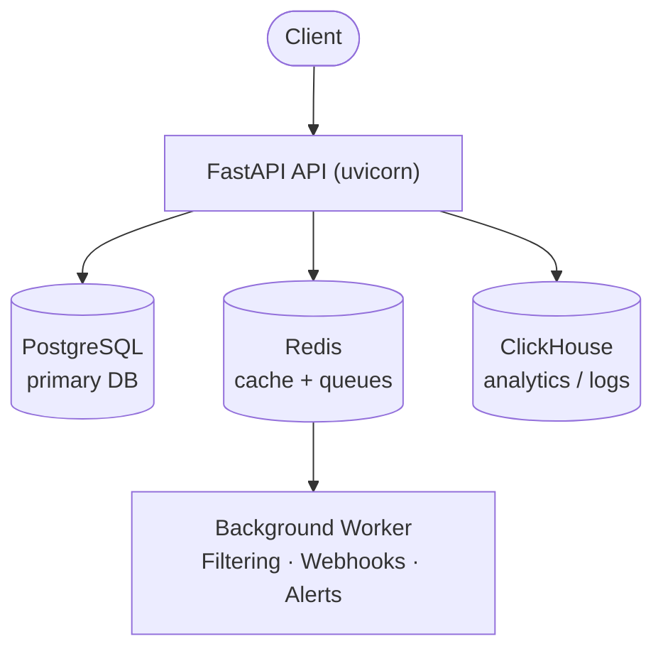

# Self-hosting overview

CollieAi can be self-hosted for full control over your data and infrastructure. You can run the entire AI firewall on your own servers — on-premise or in your own cloud — and this section covers everything you need to deploy it.


**Key points**

* CollieAi can be self-hosted on your own infrastructure for full control over data and deployment.
* It runs as five components: a FastAPI API server, PostgreSQL, ClickHouse, Redis, and a background worker.
* Optional ML models (prompt injection, LLM detection, language detection) auto-download from HuggingFace on first startup.
* Self-hosted billing is disabled by default, so there are no usage limits on API calls, prompt size, or projects.


## System Requirements

| Requirement             | Minimum version |
| ----------------------- | --------------- |
| Python                  | 3.11+           |
| Docker & Docker Compose | Latest stable   |
| Git                     | 2.x             |

## Architecture

CollieAI consists of five core components:

| Component             | Technology       | Purpose                                             |
| --------------------- | ---------------- | --------------------------------------------------- |
| **API server**        | FastAPI (ASGI)   | REST API, proxy endpoints, dashboard backend        |
| **Primary database**  | PostgreSQL 16    | Projects, policies, rules, users, API keys          |
| **Analytics store**   | ClickHouse 24.11 | Request logs, analytics, audit trail                |
| **Cache & queues**    | Redis 7          | Caching, background job queues, rate limiting       |
| **Background worker** | Python process   | Async filtering, webhook delivery, alert evaluation |

### Components Diagram



The API server handles all HTTP traffic: proxy requests, REST endpoints, and the frontend dashboard. When an async job is created, the API enqueues work into Redis. The background worker picks up jobs from Redis queues, runs security filtering, delivers webhooks, and evaluates alert conditions.

## ML Models

CollieAi uses optional machine learning models for advanced security rules:

| Model                       | Purpose                                            | Notes                                                                                                                                                                                            |
| --------------------------- | -------------------------------------------------- | ------------------------------------------------------------------------------------------------------------------------------------------------------------------------------------------------ |
| **Lightweight classifiers** | Prompt injection detection                         | Small, fast classifiers                                                                                                                                                                          |
| **LLM detection**           | Generative AI-based threat detection               | Default: Qwen2.5-0.5B-Instruct. Qwen3-8B available as opt-in higher-quality classifier (8-bit, ≥10 GB VRAM). See [LLM Detection rule docs](../security-rules/blocking-threats/llm-detection.md). |
| **Language detection**      | Identify message language for language-based rules | FastText lid.176.ftz                                                                                                                                                                             |

Models are **auto-downloaded from HuggingFace** on first startup when `PRELOAD_MODELS=true`. A valid `HF_TOKEN` is required for gated models. Set `PRELOAD_MODELS=false` to skip model loading for faster startup during development (rules that depend on ML models will silently fail open).

## How does billing work when self-hosting?

When self-hosting, subscription billing is **disabled by default**. The environment variable `BILLING_ENABLED` defaults to `false`, which means:

* No usage limits (API calls, prompt size, project count are all unlimited)
* Billing API endpoints return `404`
* No Stripe integration or billing UI in the dashboard
* The Pricing page shows plan details for reference only

If you want to enable Stripe billing on a self-hosted instance (e.g., for an internal billing system), add the following to your `.env` file:

```bash
BILLING_ENABLED=true
STRIPE_SECRET_KEY=sk_live_...
STRIPE_PUBLISHABLE_KEY=pk_live_...
STRIPE_WEBHOOK_SECRET=whsec_...
STRIPE_GROWTH_PRICE_ID=price_...
```


`STRIPE_SECRET_KEY` and `STRIPE_WEBHOOK_SECRET` are sensitive credentials. Keep them in `.env` (which is gitignored) and never commit them to version control.


See [Plans & Billing](../getting-started/plans-and-billing.md) for details on plan limits.

## Next Steps

* [**Local Development**](local-development.md) -- step-by-step guide to running CollieAi on your machine.

### Frequently asked questions

**Can I self-host CollieAi?** Yes. CollieAi can be self-hosted on your own servers, on-premise or in your own cloud, giving you full control over your data and infrastructure. It runs with FastAPI, PostgreSQL, ClickHouse, and Redis via Docker Compose.

**Does self-hosting CollieAi have usage limits?** No. When self-hosted, billing is disabled by default (`BILLING_ENABLED=false`), so API calls, prompt size, and project count are all unlimited, with no Stripe integration or billing UI.

**What do I need to run CollieAi on my own infrastructure?** You need Python 3.11+, Docker and Docker Compose, and Git. Optional ML models for prompt injection, LLM detection, and language detection auto-download from HuggingFace on first startup.
